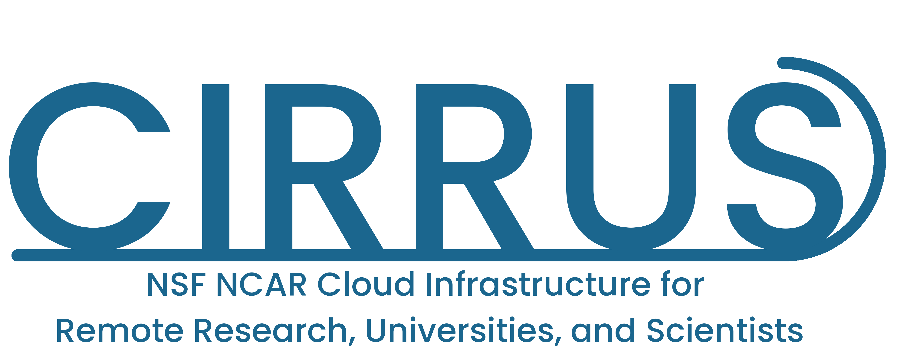

    

# Admin Documentation

## Vision

*Provide and operate an on-premise cloud offering for the scientific community to supplement traditional HPC services and public cloud offerings.*

### What is an on-premise cloud?
NSF NCAR | CISL runs Compute, Storage & Network hardware in robust Data Centers at multiple organizational facilities. An on-premise cloud is offering users the ability to utilize those highly available organizationally supported compute resources for approved use cases. This includes access to routable network space and UCAR Domain Name Systems (DNS). Security standards set by the organization are implemented and controlled by administrators to make sure internal policies are being adhered to. These resources would be provided to supplement computing needs that aren't fulfilled by the HPC offering, public cloud, or what is available to you locally. 